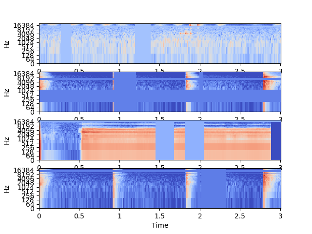

# keras_SpecAugment
Generator that performs Spec_Augment using librosa.

# Overview
Spec_Augment Generator using tensorflow (keras).

See Usage for testing.


# Environment
- MacOS Mojave 10.14.5
- Python 3.7.0

```
$ git clone https://github.com/T-Sumida/keras_SpecAugment.git
$ cd keras_SpecAugment
$ pip install -r requirements.txt
```

# Usage
```
$ python main.py
```


```
[config.yaml]
sr: 44100           -> sampling rate
audio_length: 3     -> target audio length[sec]
mel_bins: 64        -> mel bin
n_fft: 1024         -> fft window size
hop_size: 512       -> fft hop size
batch_size: 4       -> batch size
spec_aug:
  T_width: 30       -> maximum mask size on time domain
  F_width: 13       -> maximum mask size on mel domain
  T_line_num: 2     -> number of masks on time domain
  F_line_num: 2     -> number of masks on mel domain

```
# License
Copyright © 2020 T_Sumida Distributed under the MIT License.
